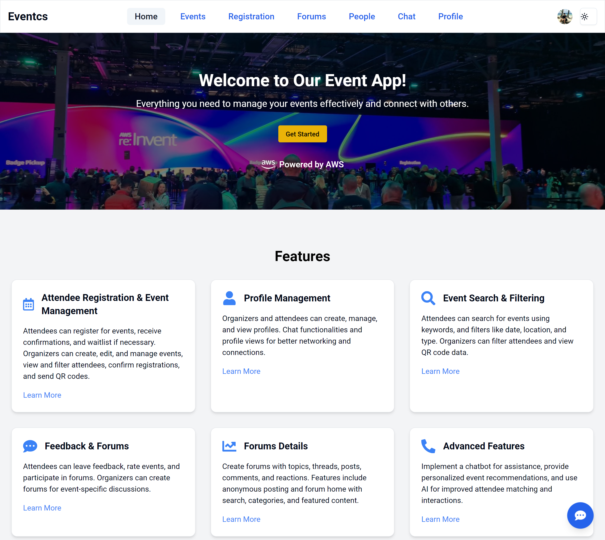
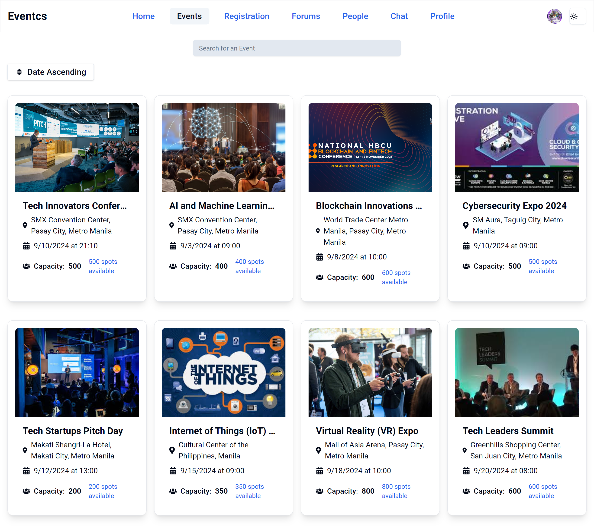
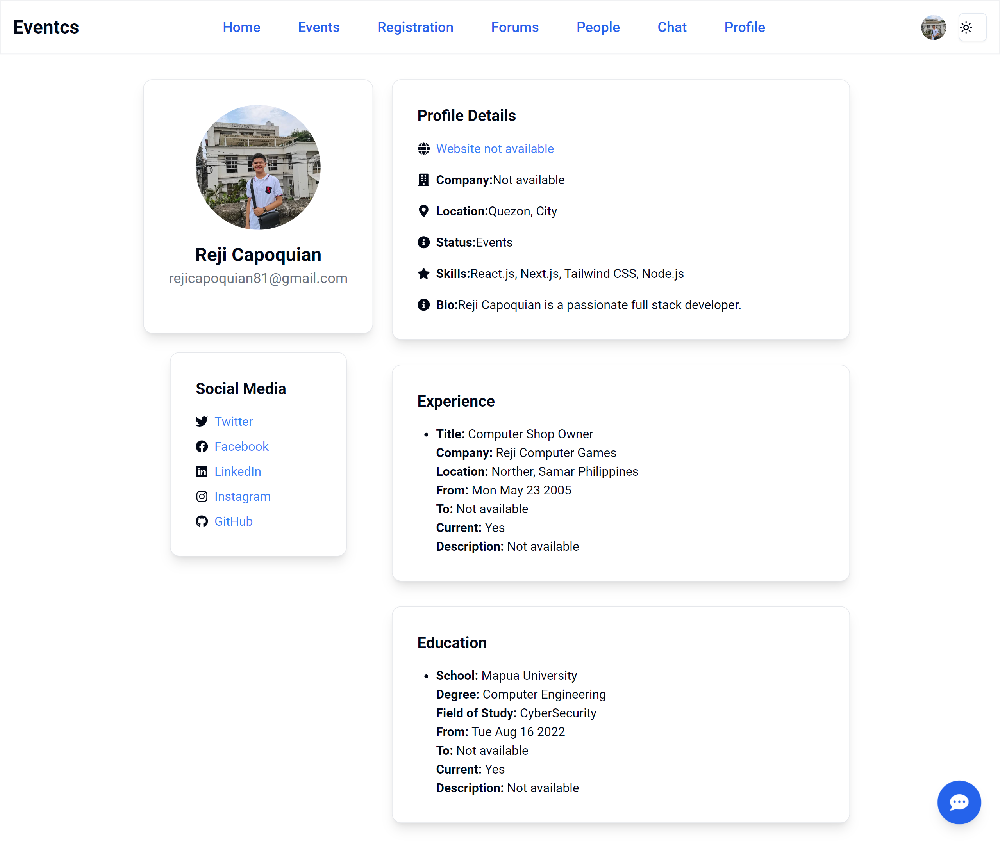
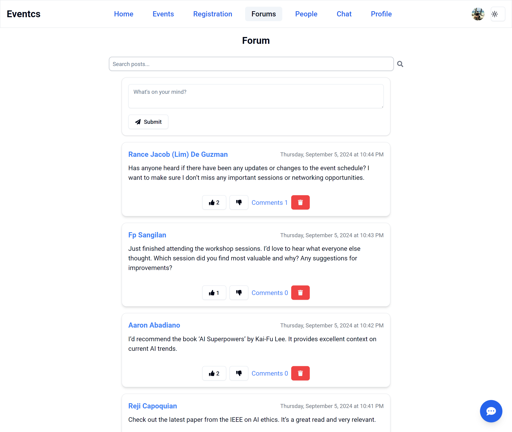
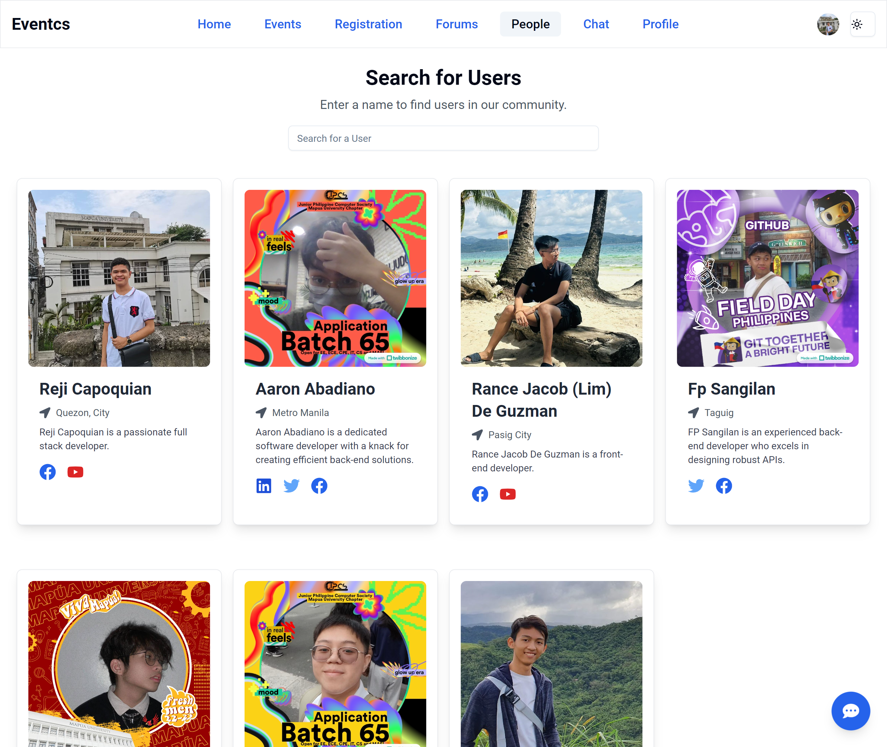

# Event Management App User Guide

## Table of Contents

1. [Introduction](#introduction)
2. [Getting Started](#getting-started)
3. [Navigating the App](#navigating-the-app)
4. [Managing Events](#managing-events)
5. [User Profile](#user-profile)
6. [Forums](#forums)
7. [People Search](#people-search)
8. [Chat](#chat)
9. [Features](#features)
10. [Troubleshooting](#troubleshooting)
11. [Contact Support](#contact-support)

## 1. Introduction

Welcome to the Event Management App! This app allows users to organize, attend, and speak at events. It includes features for event search, registration, profile management, and chat functionalities.

## 2. Getting Started

### Accessing the App

To start using the app, visit [www.eventcs.com](http://www.eventcs.com).

### Creating an Account

1. Click on the "Sign Up" button on the homepage.
2. Fill in your details such as name, email, and password.
3. Click "Register" to create your account.

### Logging In

1. Click on the "Log In" button on the homepage.
2. Enter your email and password.
3. Click "Log In" to access your account.

## 3. Navigating the App

The app includes the following main sections:

- **Home Page:** Welcome page with a hero section, search bar, and featured events.
  
- **Events:** Browse and search for events.
  
- **Profile:** Manage user profile information.
  
- **Forums:** Participate in event-related discussions.
  
- **People:** Search for and connect with other users.
  
- **Chat:** Communicate with other users in real-time.
  

## 4. Managing Events

### Browsing Events

- Navigate to the "Events" section from the navigation bar.
- Browse through the list of events or use the search bar to find specific events.

### Registering for Events

- Click on an event to view its details.
- Click the "Register" button to register for the event.

### Creating Events

- Navigate to the "Create Event" section from the navigation bar.
- Fill in the event details such as name, date, time, location, and description.
- Click the "Create" button to create the event.

## 5. User Profile

### Viewing Profile

- Navigate to the "Profile" section from the navigation bar.
- View your profile information including name, email, and registered events.

### Editing Profile

- Click the "Edit Profile" button.
- Update your profile information such as name, email, and profile picture.
- Click the "Save" button to save the changes.

## 6. Forums

### Browsing Forums

- Navigate to the "Forums" section from the navigation bar.
- Browse through the list of forum posts or use the search bar to find specific discussions.

### Creating Forum Posts

- Click the "New Post" button.
- Fill in the post details such as title and content.
- Click the "Post" button to create the forum post.

## 7. People Search

### Searching for People

- Navigate to the "People" section from the navigation bar.
- Use the search bar to find specific users.
- Click on a user to view their profile.

## 8. Chat

### Accessing Chat

- Navigate to the "Chat" section from the navigation bar.
- View your chat conversations and click on a conversation to open it.

### Sending Messages

- Type your message in the input field.
- Click the "Send" button or press Enter to send the message.

## 9. Features

The Event Management App includes the following features:

- **Event Search:** Easily search for events using keywords and filters.
- **Event Registration:** Register for events with a single click.
- **Event Creation:** Create and manage your own events.
- **User Profile Management:** View and edit your profile information.
- **Forums:** Participate in discussions related to events.
- **People Search:** Find and connect with other users.
- **Real-time Chat:** Communicate with other users in real-time.
- **Featured Events:** Highlighted events on the homepage.
- **Responsive Design:** Optimized for both desktop and mobile devices.
- **Notifications:** Receive notifications for event updates and messages.
- **User Authentication:** Secure login and registration process.
- **QR Code Scanner:** Scan QR codes for event check-ins and other functionalities.
- **Emailer:** Send and receive emails for event notifications and updates.
- **Gen AI using Bedrock:** Utilize generative AI capabilities powered by Bedrock for enhanced user experiences.
- **AWS Deployment:** The app is deployed using AWS for reliable and scalable performance.

## 10. Troubleshooting

### Common Issues

- **Unable to Register for Events:** Ensure you are logged in and have filled in all required fields.
- **Profile Information Not Updating:** Ensure you have clicked the "Save" button after making changes.
- **Chat Messages Not Sending:** Check your internet connection and try refreshing the page.

## 11. Contact Support

If you encounter any issues or have any questions, please contact our hacker at https://web.facebook.com/rejicapoquian81.

## Here are the images

You can find all the images used in this documentation in the [image repository](https://github.com/rtcapoquian/front-end-User-Service/tree/main/images).
